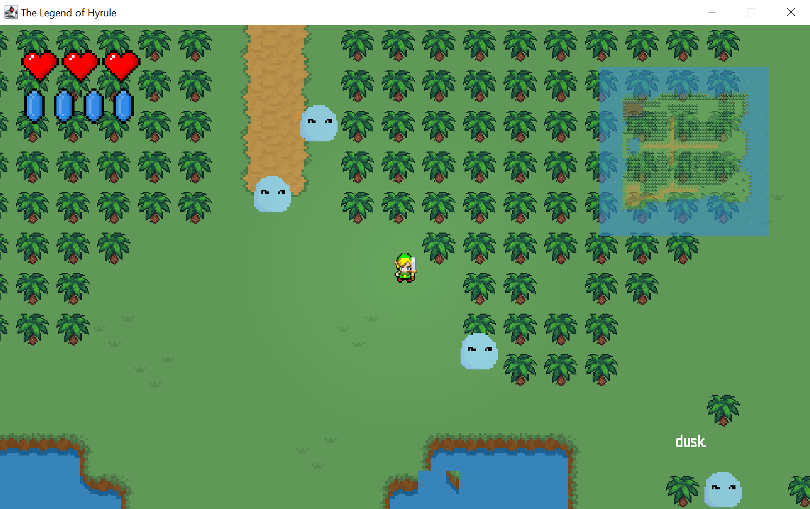

# 
Welcome to The Legend of Hyrule, Warrior! 

# Introduction 
The “The Legend of Hyrule” is a Java-based 2D game application that brings players into an immersive world filled with characters, adventures, and challenges.  This README provides a brief overview of the story of the game, the rules of the game, how to play the game, and the expected outcomes of the game.

## Story 
In the enchanting realm of The Legend of Hyrule, darkness looms over the picturesque village. Unveil your destiny as the valiant warrior chosen to embark on a legendary quest to save your beloved village from an ominous curse. The only hope lies in the mythical Diamond of Radiance, a gem of unparalleled power that can dispel the shadows and restore harmony. The sage Eldrith calls upon you, for only you possess the courage to rise against adversity and become the hero Minish Haven desperately needs.

As the sun sets on Minish Haven, the sage Eldrith reveals that an ancient curse threatens the village's very essence. To save Minish Haven, you must find the legendary Diamond of Radiance hidden deep within the mysterious Forest of Whispers. Only this gem can break the curse and return life's vibrancy to the village.

## Rules of the game: 
The game follows a set of rules that govern the player’s interactions within the game world.

1. As the game starts, the player is greeted with the sight of three vibrant red hearts symbolizing their available lives as he plays the game. These hearts serve as a representation of the player’s chances to navigate the challenges ahead.  While playing the game, if the player has not been able to defeat the monster then he will gradually lose his life.  After being defeated by the monster, the player will be prompted with a message `GAME OVER` and will be provided with 2 options; either to `Start Over` or to `Quit` the game else if the player has been able to defeat the monster, he will be able to continue the game and level up.

2. If the player chooses to continue the game after clicking the `Start Over` button, the previous items, coins, and treasures that he collected previously will remain the same and he will be able to increase the counts while continuing to play the game.

3. If the player selects the option to `Quit` the game, he will return to the main screen where he will be provided with the options to either play a `NEW GAME`, `LOAD GAME`, or `EXIT`.

4. In order for the player to win the game, he must collect the diamond.

5. Player cannot walk or run into the trees to hide from monsters.

## How to play the game: 
1.	In order to move the character in the North-South-East-West directions, you have to use the following keys: 

      - `A`: Move Left 
      - `S`: Move Down 
      - `D`: Move Right 
      - `W`: Move Up 

2.	Press `Esc` to view the following options: 

    -	`Full Screen` 
    -	`Music` 
    -	`Sound Effects` 
    -	`Control` 
    -	`End Game` 
    -	`Back` 

3.	To select items or options, press `Enter`.

4.	To attack the monsters, press `Enter` for sword and press `f` to cast a fireball.

5.	Pressing the `p` button will pause the game with the message `PAUSED` on the screen.  To resume the game you can simply press the `p` button again.

6.	Pressing the `c` button will display a board how the Player Stats which includes vel, HP, Mana, Strength, Agility, Attack, Defense, XP, Next Level, Gold, Weapon, and Armor.  The player will also be able to choose from his collected items.

7.	To interact with an NPC (non-player character), approach them and press the `Enter` key.

8.  Pressing the `Enter` key also enables the player to open the chest.

9.  Use the `Spacebar` key to guard (This helps in reducing the damage by 2).

10. The player can go to the lake or to the healer which is the cat and press the `Enter` to heal.

11.	To collect an item, simply walk over it.

## Items: 

1.	💰 Gold coins: These coins are used to purchase items, equipment, upgrades, or services within the game.
2.	🕯️ Candles: Help to ward off the shadows of the unknown.
3.	⛺ Camping Tent: To sleep and hide from the monsters.
4.	🔮 Mana: Mana is a magical resource used to cast spells, use special abilities, or perform powerful attacks.
5.	❤️ Red Hearts: Increase player’s lives.
6.	⚔️ Weapons: To fight against monsters.
7.	🛡️ Armor: To guard from monsters.
8.	⚫ Black Crystal: To gain health points.
9.	💎 Treasure: Collect the diamond to win.

## How to run the project: 

1. Clone the repository.
2. Navigate to the project directory where src folder is saved using your terminal.
3. Compile the code using: `javac character/*.java tile/*.java object/*.java monster/*.java main/*. java`.
4. Run the game: `java main. Main`.

## Embark on the Legend of Hyrule Game!

The Legend of Hyrule Game awaits your courage and wit. Face off against the Forest Monster, collect hidden loot, and unravel the secret of the Diamond of Radiance. Become the hero The Legend of Hyrule yearns for and bask in the glory of your valiant deeds!

# Contributors: 
- KOWLESSUR Hritika Chooshini (2111897) 
- VENKATASAMI Jaanavi (2115998) 
- YENKETERAMDOO Gitanjali (2115982) 

